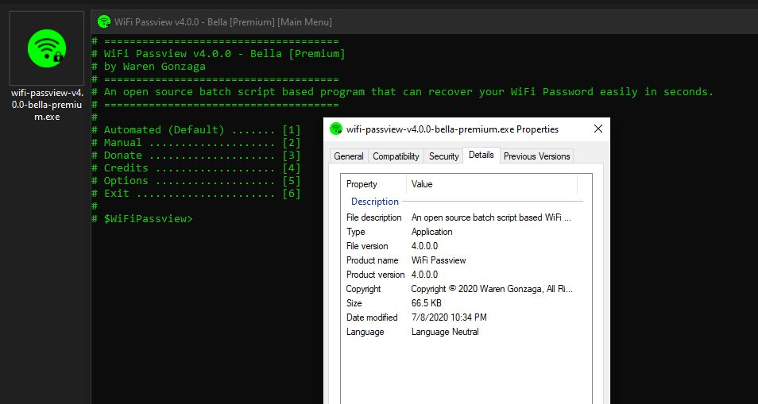

# WiFi Passview

[](https://bmc.xyz/warengonzaga) [](https://github.com/warengonzaga/wifi-passview/releases) [](https://github.com/warengonzaga/wifi-passview/stargazers) [](https://github.com/WarenGonzaga/wifi-passview/network/members) [](https://github.com/warengonzaga/wifi-passview/blob/main/LICENSE)


**WiFi Passview** is an open-source batch script-based program that can recover your WiFi Password easily in seconds. This is for Windows OS only. Basically, this scripted program has the same function as other passview software such as webpassview and mailpassview. [Visit Wiki](https://github.com/warengonzaga/wifi-passview/wiki)

_**Disclaimer**: WiFi Passview is **NOT** designed for malicious use! Please use this program responsibly!_

## Featured By

The project has been featured in some popular cybersecurity websites and Facebook Pages such as **[KitPloit.com (v2)](https://www.kitploit.com/2020/03/wifi-passview-v20-open-source-batch.html)**/**[KitPloit.com (v4)](https://www.kitploit.com/2020/07/wifi-passview-v40-open-source-batch.html)**, **[Hakin9.org](https://hakin9.org/wifi-passview-an-open-source-batch-script-based-wifi-passview-for-windows)**, **[Pentest Magazine](https://pentestmag.com/wifi-passview)**, **[Malware Devil](https://www.malwaredevil.com/2020/07/13/wifi-passview-an-open-source-batch-script-based-wifi-passview-for-windows)**, and **[National Cyber Security Services](https://www.facebook.com/ncybersec/posts/1526004767570242)**.

[](https://www.producthunt.com/posts/wifi-passview?utm_source=badge-featured&utm_medium=badge&utm_souce=badge-wifi-passview)

## How it Works

Basically, this is the shortcut and batch scripted file version of a popular WiFi password manager viewing method using the command prompt. This is how it works...

```bash
netsh wlan show profiles
```

When you use this tool, you are able to extract the WiFi passwords stored on the target machine in just seconds.

To learn more [visit Wiki](https://github.com/warengonzaga/wifi-passview/wiki) page...

## Features

This simple tool offers you the following features...

* Extract all available WiFi passwords stored in the target machine and can be done in just a seconds.
* Extract password from specific target SSID.
* Save extracted passwords.
* Additional options.
* No manual reading of **``Key Content``**, the tool will do that for you!
* No need admin rights to run the program.
* Standalone batch program.
* Supports all languages.
* Generate WLAN report. (requires admin privileges)
* Upload collected passwords to the cloud. (powered by file.io api)
* Customizable builds.

## Usage

Download the repository and look for **``"wifi-passview-vX.X.X.bat"``** file and run it as ordinary ``*.bat`` file (_no need to run it as administrator_). All you have to do is to follow the on-screen instructions.

Read the official blog on **[How to Use WiFi Passview](https://warengonzaga.com/wifi-passview-for-windows-os)**.

_Wanna use for WiFi Hacking? Visit this [exclusive post from the author](https://www.buymeacoffee.com/p/40225)._

## Preview and In Action

Here's the screeshot of the program, click it to see it in action. Don't forget to like, share, and subscribe to my channel!

[](https://youtu.be/eu1DUgwP2wM)

## Custom Developpment

* Download the repository
* Do **``"npm install"``** and **``"npm install gulp-cli -g && npm install gulp -D"``**
* After that, edit the **``"./src/config.json"``** file for your customization or personalization.
* When you think you are satisfy, just do **``"gulp build"``** or **``"gulp"``** to initiate the building process.
* If you want to reset the building process just do **``"gulp cleandev"``**.
* If you are editing the **``"./src/core.bat"``** you can use **``"gulp test"``**  it is a combination of **``"gulp build"``** and **``"gulp cleandev"``** so you can quickly quality check the production build.
* Do **``"gulp --tasks"``** to see all available **``"gulp"``** commands.

## Premium Version

Looking for the official **``"wifi-passview-vX.X.X.exe"``** version and wanna support the project?



[](https://bmc.xyz/l/wifipassview)

## FAQs

**Q**: Why you don't use the built-in ``netsh wlan`` export command?

> _I'm aware of that command, the only reason why I use ``findstr`` instead of that command is that to make the tool more user-level that does not require any admin rights. For example, if you are about to use the tool in a machine that you don't own then you're not able to use the tool. Got the idea? If the tool does not require admin rights then we can avoid the UAC prompt and we can use the tool more efficiently, the command ``netsh wlan show profiles`` do not require admin rights that's why we can still use that and capture the data and save it to file using the ``findstr`` command. Brilliant?_

Visit [FAQ section](https://github.com/warengonzaga/wifi-passview/wiki/Frequently-Asked-Questions) for more information.

## Contributing

Contributions are welcome, create a pull request to **dev** branch of this repo and I will review your code.

## Issues

If you're facing a problem in using WiFi Passview please let me know by creating an issue in this github repository. I'm happy to help you! Don't forget to provide some screenshot or error logs of it!

## To Do

* Support other language
* Extract WiFi Password Across Network (experimental)
* More... (have suggestions? let me know!)

## Community

Wanna see other projects I made? Join today!

[](https://bmc.xyz/warengonzaga)

## License

WiFi Passview is licensed under GNU General Public License v3 - <https://opensource.org/licenses/GPL-3.0>

## Author

This project is created by **[Waren Gonzaga](https://github.com/warengonzaga)** for educational purposes.

[](https://facebook.com/warengonzagaofficial) [](https://twitter.com/warengonzaga) [](https://linkedin.com/in/warengonzagaofficial) [](https://youtube.com/warengonzaga) [](https://dev.to/warengonzaga) [](https://dev.to/warengonzaga)

---

:computer: Made with :heart: and :coffee: by Waren Gonzaga with **YHWH** :pray:
