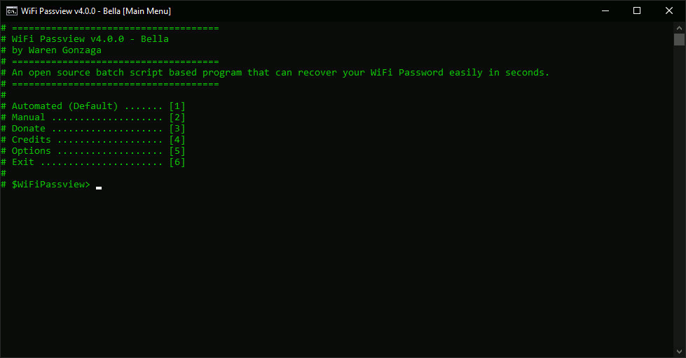

# WiFi Passview 

   

**WiFi Passview** is an open-source batch script-based program that can recover your WiFi Password easily in seconds. This is for Windows OS only. Basically, this scripted program has the same function as other passview software such as webpassview and mailpassview.

_**Disclaimer**: WiFi Passview is **NOT** designed for malicious use! Please use this program responsibly!_

## 💖 Featured By

The project has been featured in some popular cybersecurity websites and Facebook Pages such as **[KitPloit.com (v2)](https://www.kitploit.com/2020/03/wifi-passview-v20-open-source-batch.html)**/**[KitPloit.com (v4)](https://www.kitploit.com/2020/07/wifi-passview-v40-open-source-batch.html)**, **[Hakin9.org](https://hakin9.org/wifi-passview-an-open-source-batch-script-based-wifi-passview-for-windows)**, **[Pentest Magazine](https://pentestmag.com/wifi-passview)**, **[Malware Devil](https://www.malwaredevil.com/2020/07/13/wifi-passview-an-open-source-batch-script-based-wifi-passview-for-windows)**, and **[National Cyber Security Services](https://www.facebook.com/ncybersec/posts/1526004767570242)**.

## 😎 Demo

Here's the screeshot of the program, click it to see it in action. Don't forget to like, share, and subscribe to my channel!

## ⚡ Features

This simple tool offers you the following features...

- Extract all available WiFi passwords stored in the target machine and can be done in just a seconds.
- Extract password from specific target SSID.
- Save extracted passwords.
- Additional options.
- No manual reading of **``Key Content``**, the tool will do that for you!
- No need admin rights to run the program.
- Standalone batch program.
- Supports all languages.
- Generate WLAN report. (requires admin privileges)
- Upload collected passwords to the cloud. (powered by file.io api)
- Customizable builds.

## 🕹️ Usage

Download the repository and look for **``"wifi-passview-vX.X.X.bat"``** file and run it as ordinary ``*.bat`` file (_no need to run it as administrator_). All you have to do is to follow the on-screen instructions.

## 📖 Documentation

Check out the official and complete documentation here.

## 🎯 Contributing

Contributions are welcome, create a pull request to this repo and I will review your code. Please consider to submit your pull request to the `dev` branch. Thank you!

Read the project's [contributing guide](./CONTRIBUTING.md) for more info.

## 💬 Discussions

For any questions, suggestions, ideas, or simply you want to share your experience in using this project, feel free to share and discuss it to the [community](https://github.com/warengonzaga/wifi-passview/discussions)!

## 🐛 Issues

Please report any issues and bugs by [creating a new issue here](https://github.com/warengonzaga/wifi-passview/issues/new), also make sure you're reporting an issue that doesn't exist. Any help to improve the project would be appreciated. Thanks! 🙏✨

## 🍀 Sponsors and Supporters

> Love what I do? Send me some [love](https://github.com/sponsors/warengonzaga) or [coffee](https://buymeacoff.ee/warengonzaga)!? 💖☕
>
> Can't send some love or coffees? 😥 Nominate me for a **[GitHub Star](https://stars.github.com/nominate)** instead!
> Your support will help me to continue working on open-source projects like this. 🙏😇

## 📋 Code of Conduct

Read the project's [code of conduct](./code_of_conduct.md).

## 📃 License

WiFi Passview is licensed under [GNU General Public License v3.0](https://opensource.org/licenses/GPL-3.0).

## 📝 Author

WiFi Passview is created by **[Waren Gonzaga](https://github.com/warengonzaga)**, with the help of awesome [contributors](https://github.com/warengonzaga/wifi-passview/graphs/contributors).

---

💻💖☕ by [Waren Gonzaga](https://warengonzaga.com) | [YHWH](https://youtu.be/9vh6Dz9oh8I?t=85) 🙏
